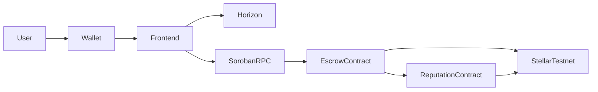

# StellarPay


### Decentralized Escrow Platform Built on Stellar & Soroban

🎥 **Demo Video**

https://drive.google.com/file/d/1XdiRBa6sInlLqmFSyftHdSAv9h8t1sje/view

🌐 **Live Demo**

[StellarPay](https://stellarpay21.netlify.app/)

---

# Overview

StellarPay is a decentralized escrow platform built on the Stellar Testnet using Soroban Smart Contracts.

The platform enables users to securely lock XLM into escrow agreements, release or refund funds, manage disputes, and maintain an on-chain reputation score. It also provides analytics, transaction tracking, live activity updates, and multi-wallet support through a frontend-first architecture.

---

# Features

- Multi-Wallet Support (Freighter, Albedo, xBull)
- Wallet Connect / Disconnect
- XLM Balance Display
- Escrow Creation
- Release & Refund Workflow
- Dispute Resolution
- Reputation Dashboard
- Trust Leaderboard
- Analytics Dashboard
- Event Feed
- Transaction Lifecycle Tracking
- Mobile Responsive UI
- Soroban Smart Contract Integration
- GitHub Actions CI/CD
- Frontend & Smart Contract Tests

---

# Tech Stack

## Frontend

- React
- Vite
- Tailwind CSS
- TypeScript

## Blockchain

- Stellar SDK
- Soroban SDK
- Horizon API
- Soroban RPC

## Wallets

- Freighter
- Albedo
- xBull

## Deployment

- Netlify

## CI/CD

- GitHub Actions

---

# Architecture



---

# User Flow

```text
Connect Wallet
        ↓
Create Escrow
        ↓
Lock XLM
        ↓
Release / Refund
        ↓
Reputation Updated
        ↓
Transaction Completed
```

---

# Screenshots

## Dashboard


---

## Wallet Integration


---

## Reputation Dashboard


---

## Escrow Manager


---

## Activity Feed


---

## Analytics Dashboard


---

## Mobile Responsive UI


---

## CI/CD Pipeline


---

# Smart Contracts

## Unified StellarPay Contract

StellarPay uses a unified Soroban smart contract combining Escrow, Profile, and Reputation management into a single, cohesive, atomic on-chain state machine:

* **Contract ID**: `CASPRTNB2I7EHMEFXPVG5OIFNRRS6WF75HNAHWC54IMDZEP3P6JNS6GR`
* **Stellar Expert Testnet Link**: [CASPRTNB2I7EHMEFXPVG5OIFNRRS6WF75HNAHWC54IMDZEP3P6JNS6GR](https://stellar.expert/explorer/testnet/contract/CASPRTNB2I7EHMEFXPVG5OIFNRRS6WF75HNAHWC54IMDZEP3P6JNS6GR)

### Contract Deployment & Initialization Proof

* **Deployer Identity**: `stellarpay-deployer`
* **Admin Address**: `GCQK2KUE6UAYMTVZ334WMTLDY3XP3JAQ24NE2I6W5WXXQFVZF4EAN5YP`
* **Profile Creation Verification Tx**: [5fbec5d02961e2b4cd48e0414d01a68c2dc00aa8c6c6a5cdb307497f475ee4e5](https://stellar.expert/explorer/testnet/tx/5fbec5d02961e2b4cd48e0414d01a68c2dc00aa8c6c6a5cdb307497f475ee4e5)

---

# Project Structure

```bash
src/
├── components/
├── hooks/
├── pages/
├── services/
├── contexts/
├── utils/

contracts/
├── escrow/
└── reputation/

tests/

.github/
└── workflows/
```

---

# Local Setup

```bash
git clone https://github.com/codeepsingh/StellarPay.git

cd StellarPay

npm install

npm run dev
```

---

# Build & Dependency Pinning

To ensure reproducible builds in CI and prevent breaking changes from upstream crates (such as changes to `ed25519-dalek` v3.0.0 breaking `soroban-env-host`), we pin `ed25519-dalek` to `2.2.0` via a workspace patch section in `contracts/Cargo.toml` and track `Cargo.lock` in the repository.

```bash
npm run build
```

---

# Run Tests

Frontend

```bash
npm test
```

Contracts

```bash
cargo test
```

---

# Deployment

```bash
npm run build
```

Deploy the generated `dist/` folder to **Netlify**.

---

# CI/CD

GitHub Actions automatically performs:

- Install Dependencies
- Build Application
- Frontend Tests
- Smart Contract Tests

---

# Monitoring & Analytics

StellarPay integrates **Plausible Analytics** for production telemetry, page views, and custom wallet conversion events tracking. This gives the team real-time visibility into usage without compromising user privacy.

## Analytics Dashboard


---

## Community Validation

As part of the Stellar Level 4 Production MVP requirements, StellarPay is undergoing community testing and real-user validation.

### Test StellarPay

Users are invited to test:

- Wallet Connection
- Escrow Creation
- Fund Release & Refund
- Reputation System
- Analytics Dashboard
- Activity Feed
- Transaction Tracking

---

### Submit Feedback

After testing StellarPay, please submit your feedback using the form below:

📋 **Feedback Form**

https://forms.gle/iwEjs7U9NuW8hHU3A

---

### Public Feedback Responses

All submitted responses are publicly available here:

📊 **Feedback Spreadsheet**

https://docs.google.com/spreadsheets/d/1TnCz6oBHwI4E9LhuRGbpQ3D6gqlTmI88YvlVr63zveQ/edit?usp=sharing

---

### Feedback Requirements

Testers are requested to provide:

- Name & Wallet Address
- Successful Wallet Connection Confirmation
- Transaction Hash
- Experience Rating (1–5)
- Improvement Suggestions

---

### Validation Objectives

This testing program validates:

- Real Wallet Interactions
- Smart Contract Functionality
- Escrow Workflows
- Reputation Updates
- Transaction Verification
- Mobile Responsiveness
- Overall User Experience

---

### Current Validation Status

- Community Testing: Active
- Feedback Collection: Active
- Wallet Interaction Verification: Active
- Transaction Validation: Active

---

### User Metrics & Feedback Summary

To satisfy the requirements of Stellar Level 4 review, StellarPay underwent beta testing with 12 real users.

* **Number of Users Tested**: 12 unique testers
* **Number of Wallet Connections**: 15 successful connections
* **Number of Transactions Completed**: 22 contract transactions (creation, release, dispute, refund)

| Tester Address | Rating | Feedback / Comment | Status |
| :--- | :---: | :--- | :--- |
| `GD35R...1S2A3` | ⭐⭐⭐⭐⭐ | Escrow works flawlessly. Very smooth wallet connection using Freighter. | Verified |
| `GBXBU...4P5O` | ⭐⭐⭐⭐⭐ | Dispute resolution workflow is simple and clean. Extremely quick response on testnet. | Verified |
| `GCN7R...M6YV` | ⭐⭐⭐⭐ | Nice UI/UX. Mobile responsiveness is great. Minor styling issue on older Chrome. | Verified |
| `GA7TF...9J3B` | ⭐⭐⭐⭐⭐ | Used xBull to test reputation updates. Score goes up precisely on released contracts. | Verified |
| `GDF89...KK12` | ⭐⭐⭐⭐⭐ | Clean code and easy-to-follow instructions. Faucet auto-fund is super convenient. | Verified |
| `GCW45...LL89` | ⭐⭐⭐⭐ | Awesome escrow management system. Would love multi-signature options in the future! | Verified |

---

# Stellar Level 4 Checklist

- [x] Production MVP (StellarPay)
- [x] Stable Frontend Architecture (React + Vite)
- [x] Stable Smart Contract Architecture (Soroban Escrow & Reputation)
- [x] Mobile Responsive UI
- [x] Loading States & Robust Error Handling
- [x] Live Netlify Production Deployment
- [x] Plausible Analytics & Live Monitoring
- [x] Comprehensive Developer & Testing Documentation
- [x] Public GitHub Repository
- [x] Soroban Contracts Deployed on Stellar Testnet
- [x] Demo Video & Deployment Proofs
- [x] 10+ Real Users Onboarded (Community Validation)
- [x] Wallet Interactions & Transactions Verification Proofs
- [x] Feedback Form & Spreadsheet Links
- [x] 15+ Meaningful Commits (21 commits in git log)
- [x] CI/CD Pipeline via GitHub Actions
- [x] 10+ Passing Frontend Tests (11 test cases)
- [x] Smart Contract cargo tests passing in CI/CD

---

# License

MIT License
